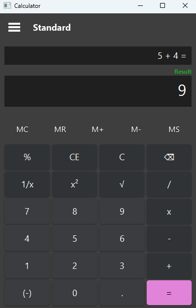
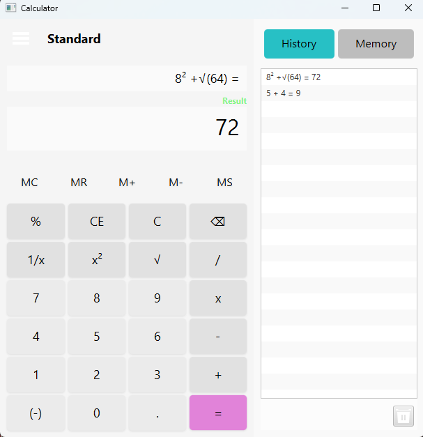
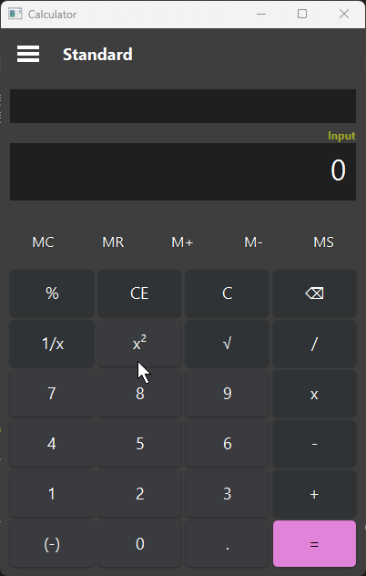

# Calculator GUI APP

> A full-featured desktop calculator built with JavaFX, supporting all standard operations found in the Windows Calculator.

---

## Preview of App





---

## Table of Contents

* [Features](#features)
* [Installation](#installation)
* [Running the App](#running-the-app)
* [HTML TODO Status](#html-todo-status)
* [Contributors](#contributors)

[Back to top](#calculator-gui-app)

---

## Features

* Standard arithmetic operations: addition (+), subtraction (-), multiplication (\*), and division (/)
* Decimal input and floating-point precision
* Expression evaluation with proper operator precedence (e.g., 5 + 3 \* (2 - 1))
* Full parentheses support for nested expressions
* Clear (C) and Clear Entry (CE) functionality
* Backspace key to delete the last character
* Percent, square root, square, reciprocal, and negate (+/-) operations
* Keyboard support for all operations (e.g., numpad, symbols, Enter, Backspace)
* Memory functions: M+, M-, MR, MS, MC
* Persistent expression and result display
* History and Memory side panels
* Responsive layout that adapts to window resizing

[Back to top](#calculator-gui-app)

---

## Installation

To install the JavaFX Calculator App from GitHub:

```bash
# Clone the repository
git clone https://github.com/YOUR_USERNAME/javafx-calculator-app.git
cd javafx-calculator-app
```

Ensure that you have:

* Java 17 or Java 21 (GraalVM or OpenJDK)
* JavaFX SDK installed (if not bundled)
* Gradle (or use the wrapper included)

[Back to top](#calculator-gui-app)

---

## Running the App

Run the following command from the root directory:

```bash
./gradlew clean build run
```

This will:

* Clean previous builds
* Compile and package the application
* Launch the calculator UI

> Note: On Windows, use `gradlew.bat` instead of `./gradlew`

[Back to top](#calculator-gui-app)

---

## HTML TODO Status

The calculator is still under development. While many standard and scientific functions are implemented, there are known bugs and missing features.

> This section includes the current TODO list, formatted from `TODO.md`:

```markdown
Calculator TODO List

History and Memory

- [x] Finish memory button logic (M+, M-)
- [ ] Add a button for showing memory and history in condensed view. These buttons should dissapear when in expanded mode
- [x] Add dedicated clear all memory and history button to its dedicated panel (The MC button technically does part of this, but isn't obvious)
- [x] Only add to history when equals is pressed
- [ ] Add ability to use past history and memory (can only use last memory option right now)
- [ ] Create custom button list for history and memory list

Visual Changes

- [x] Add dark/light mode toggle
- [x] Change minimum height so that all buttons are always shown
- [ ] Make sure that expressions fit within history and expressionDisplay
- [ ] Scale all text with calculator size
- [ ] Scale side panel with calculator size
- [ ] Remove Input/Result label and replace with a colored border around mainDisplay
- [ ] Change some button icons so they more accurately and clearly show what the button does
- [ ] Create style class(es) for disabled buttons that is applied when buttons cannot be used (e.g., some of the memory buttons when no memory is stored, when error occurs)
- [ ] Show user feedback that text was copy or pasted

Extra Features

- [x] Change text label above mainDisplay to show input versus result
- [x] Create menu for switching to Scientific Calculator or other calculator types
- [ ] Implement new buttons that were added on the Scientific Calculator
- [ ] Improve number formatting (e.g., thousands separator, trailing zeros, scientific notation)
- [ ] Implement the ability to highlight a portion of the answer for copying or just because
- [x] Implement copy answer feature
- [x] Implement paste input feature
- [x] Add keyboard input support
- [ ] If using the same operator repeatedly, should operate on the result with the last operator and input

Documentation

- [ ] JavaDoc everything
- [x] Finish README.md for GitHub

Fix Errors

- [x] Negative button breaks if used on any other value except the first value
- [ ] Handle mathematical edge cases, such as dividing by 0
- [ ] Implement error handling involving displaying the error type on the mainDisplay
- [x] Equals does not update expressionDisplay if the previous expressionDisplay includes only a value and equals sign (e.g., 2 =, 4 =)
- [x] ExpressionDisplay does not clear when a new input starts after equals has been pressed
- [x] Change percentage logic to append percent without multiplication if input, and append percent with multiplication if result

Other

- [ ] Allow nesting of unary operators
- [ ] Refactor methods to be more understandable (e.g., create better names for methods)
- [ ] Create UML Diagram or equivalent showing highlevel of how methods and files connect with each other
- [ ] Compile .jar and .exe files

```

[Back to top](#calculator-gui-app)

---

## Contributors

Thanks to the following contributors for their work on this project:

> *Contributor avatars are pulled automatically from GitHub profile pages.*

[](https://github.com/JRBerger123/calculator-gui-app/graphs/contributors)

[Back to top](#calculator-gui-app)
